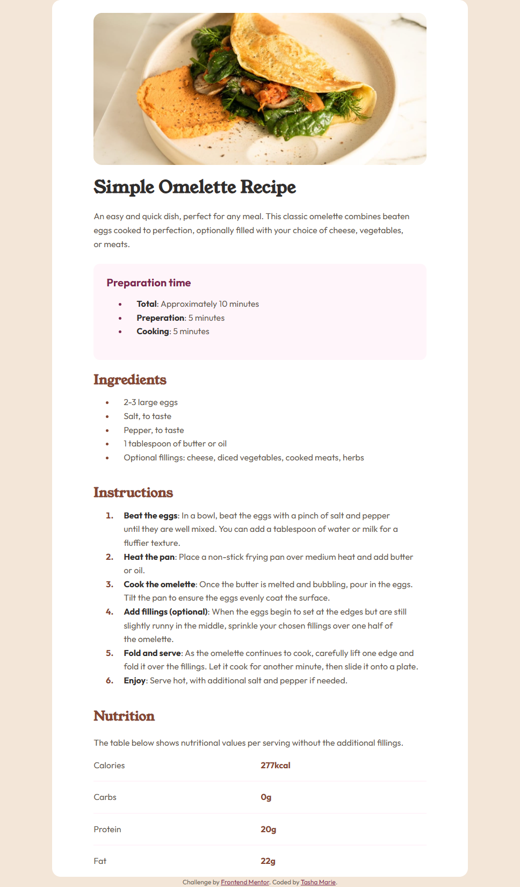

# Frontend Mentor - Recipe page solution

This is a solution to the [Recipe page challenge on Frontend Mentor](https://www.frontendmentor.io/challenges/recipe-page-KiTsR8QQKm). Frontend Mentor challenges help you improve your coding skills by building realistic projects. 

## Table of contents

- [Overview](#overview)
  - [The challenge](#the-challenge)
  - [Screenshot](#screenshot)
  - [Links](#links)
- [My process](#my-process)
  - [Built with](#built-with)
  - [What I learned](#what-i-learned)
  - [Continued development](#continued-development)
  - [Useful resources](#useful-resources)
- [Author](#author)

### Screenshot

### Links

- Solution URL: [My Solution](https://github.com/tasha-marie/recipe-page-main)
- Live Site URL: [Live Site](https://tasha-marie.github.io/recipe-page-main/)

## My process

### Built with

- Semantic HTML5 markup
- CSS custom properties

### What I learned

I learned about using percentages for widths to keep things more responsive. I had never even considered that the browser is already responsive and we are the ones who mess it up! I also dug deeper into understanding the differences between rem em and relation to pixels. This is helping me create more responsive layouts from the start, without using a ton of media queries. 

### Continued development

Though I did not use it for this project, I am still focusing on learning grid, as well as semantic HTML and how to create responsive sites. 

### Useful resources

- [Conquering Responsive Layouts](https://www.kevinpowell.co/courses/) - This helped me understand the reasons behind not using set widths and heights, as well as explained em and rem. I like that it is a drip course that requires you to practice skills before moving on to the next section. 
- [Professional CSS Build a Website From Scratch](https://frontendmasters.com/courses/pro-css/) - Found this one on Frontend Masters and am really digging Kevin Powell and the way that he explains things. 

## Author

- Frontend Mentor - [@tasha-marie](https://www.frontendmentor.io/profile/tasha-marie)
- LinkedIn - [Tasha Hollingsworth](https://www.linkedin.com/in/tasha-hollingsworth-37702b372/)
- BlueSky - [@quad-skater](https://bsky.app/profile/quad-skater.bsky.social)

